# NTRIP-client-for-Arduino

Fork from: [GLAY-AK2/NTRIP-client-for-Arduino](https://github.com/GLAY-AK2/NTRIP-client-for-Arduino)

NTRIP client library for ESP32 (Arduino). Receives RTCM3 correction data from NTRIP Caster and outputs via RS232 to GNSS receivers.

## アーキテクチャ

```mermaid
flowchart TD

subgraph group_package["Arduino package"]
  node_repo["NTRIP client<br/>Arduino library"]
end

subgraph group_core["Core bridge"]
  node_src_ntrip["NTRIPClient<br/>core bridge<br/>[NTRIPClient.cpp]"]
  node_src_ntrip_h["Client API<br/>header<br/>[NTRIPClient.h]"]
end

subgraph group_examples["Example apps"]
  node_m5stack_wps["M5Stack WPS<br/>example app<br/>[M5Stack_WPS.ino]"]
  node_m5stack_wifi["M5Stack WiFiManager<br/>example app"]
  node_m5atom_wps["M5Atom WPS<br/>example app<br/>[M5Atom_WPS.ino]"]
  node_m5atom_wifi["M5Atom WiFiManager<br/>example app"]
  node_wps_helper_stack["WPS helper<br/>provisioning helper<br/>[wpsConnector.cpp]"]
  node_wps_helper_atom["WPS helper<br/>provisioning helper<br/>[wpsConnector.cpp]"]
  node_wifi_manager["WiFiManager<br/>external lib"]
  node_ui_stack["LCD status<br/>device UI"]
  node_ui_atom(("LED status<br/>device UI"))
  node_button(("Server button<br/>control input"))
end

subgraph group_external["External systems"]
  node_caster[("NTRIP caster<br/>remote source")]
  node_wifi{{"Wi-Fi network<br/>connectivity"}}
  node_gnss[("GNSS receiver<br/>serial sink")]
  node_serial2["Serial2 RS232<br/>hardware link"]
end

node_repo -->|"packages"| node_src_ntrip
node_repo -->|"includes"| node_m5stack_wps
node_repo -->|"includes"| node_m5stack_wifi
node_repo -->|"includes"| node_m5atom_wps
node_repo -->|"includes"| node_m5atom_wifi
node_src_ntrip -->|"API"| node_src_ntrip_h
node_m5stack_wps -->|"uses"| node_src_ntrip
node_m5stack_wifi -->|"uses"| node_src_ntrip
node_m5atom_wps -->|"uses"| node_src_ntrip
node_m5atom_wifi -->|"uses"| node_src_ntrip
node_m5stack_wps -->|"provisions"| node_wps_helper_stack
node_m5atom_wps -->|"provisions"| node_wps_helper_atom
node_m5stack_wifi -->|"provisions"| node_wifi_manager
node_m5atom_wifi -->|"provisions"| node_wifi_manager
node_m5stack_wps -->|"shows status"| node_ui_stack
node_m5stack_wifi -->|"shows status"| node_ui_stack
node_m5atom_wps -->|"shows status"| node_ui_atom
node_m5atom_wifi -->|"shows status"| node_ui_atom
node_m5stack_wps -->|"cycles server"| node_button
node_m5stack_wifi -->|"cycles server"| node_button
node_m5atom_wps -->|"cycles server"| node_button
node_m5atom_wifi -->|"cycles server"| node_button
node_m5stack_wps -->|"connects via"| node_wifi
node_m5stack_wifi -->|"connects via"| node_wifi
node_m5atom_wps -->|"connects via"| node_wifi
node_m5atom_wifi -->|"connects via"| node_wifi
node_src_ntrip -->|"fetches RTCM3"| node_caster
node_caster -->|"rides on"| node_wifi
node_src_ntrip -->|"writes bytes"| node_serial2
node_serial2 -->|"feeds corrections"| node_gnss

click node_src_ntrip "https://github.com/yasunorioi/NTRIP-client-for-Arduino/blob/master/src/NTRIPClient.cpp"
click node_src_ntrip_h "https://github.com/yasunorioi/NTRIP-client-for-Arduino/blob/master/src/NTRIPClient.h"
click node_m5stack_wps "https://github.com/yasunorioi/NTRIP-client-for-Arduino/blob/master/examples/M5Stack_WPS/M5Stack_WPS.ino"
click node_m5stack_wifi "https://github.com/yasunorioi/NTRIP-client-for-Arduino/blob/master/examples/M5Stack_WiFiManager/M5Stack_WiFiManager.ino"
click node_m5atom_wps "https://github.com/yasunorioi/NTRIP-client-for-Arduino/blob/master/examples/M5Atom_WPS/M5Atom_WPS.ino"
click node_m5atom_wifi "https://github.com/yasunorioi/NTRIP-client-for-Arduino/blob/master/examples/M5Atom_WiFiManager/M5Atom_WiFiManager.ino"
click node_wps_helper_stack "https://github.com/yasunorioi/NTRIP-client-for-Arduino/blob/master/examples/M5Stack_WPS/wpsConnector.cpp"
click node_wps_helper_atom "https://github.com/yasunorioi/NTRIP-client-for-Arduino/blob/master/examples/M5Atom_WPS/wpsConnector.cpp"

classDef toneNeutral fill:#f8fafc,stroke:#334155,stroke-width:1.5px,color:#0f172a
classDef toneBlue fill:#dbeafe,stroke:#2563eb,stroke-width:1.5px,color:#172554
classDef toneAmber fill:#fef3c7,stroke:#d97706,stroke-width:1.5px,color:#78350f
classDef toneMint fill:#dcfce7,stroke:#16a34a,stroke-width:1.5px,color:#14532d
classDef toneRose fill:#ffe4e6,stroke:#e11d48,stroke-width:1.5px,color:#881337
classDef toneIndigo fill:#e0e7ff,stroke:#4f46e5,stroke-width:1.5px,color:#312e81
classDef toneTeal fill:#ccfbf1,stroke:#0f766e,stroke-width:1.5px,color:#134e4a
class node_repo toneBlue
class node_src_ntrip,node_src_ntrip_h toneAmber
class node_m5stack_wps,node_m5stack_wifi,node_m5atom_wps,node_m5atom_wifi,node_wps_helper_stack,node_wps_helper_atom,node_wifi_manager,node_ui_stack,node_ui_atom,node_button toneMint
class node_caster,node_wifi,node_gnss,node_serial2 toneRose
```



## Examples

5 combinations of hardware and WiFi configuration method:

| Example | Hardware | WiFi Config | RS232 Port |
|---------|----------|-------------|------------|
| `M5Stack_WPS` | M5Stack + RS232 Kit | WPS | Serial2 (TX=17, RX=16) |
| `M5Stack_WiFiManager` | M5Stack + RS232 Kit | WiFiManager (captive portal) | Serial2 (TX=17, RX=16) |
| `M5Atom_WPS` | M5Atom + Atomic RS232 Base | WPS | Serial2 (TX=19, RX=22) |
| `M5Atom_WiFiManager` | M5Atom + Atomic RS232 Base | WiFiManager (captive portal) | Serial2 (TX=19, RX=22) |
| `AtomS3_WiFiManager` | M5 AtomS3 + Atom RS232 Base | WiFiManager (captive portal) | Serial2 (TX=G6, RX=G5) |

### Hardware

- **M5Stack + RS232 Kit**: [M5Stack RS232 Module](https://shop.m5stack.com/products/rs232-module-13-2) via I2C port. LCD display shows NTRIP status and data rate.
- **M5Atom + Atomic RS232 Base**: [Atomic RS232 Kit](https://shop.m5stack.com/collections/m5-atom/products/atom-rs232-kit). LED color indicates active NTRIP server.
- **M5 AtomS3 + Atom RS232 Base**: [Atomic RS232 Base](https://shop.m5stack.com/products/atomic-rs232-base) with AtomS3 host. 128x128 LCD shows Info / Sky / Graph / QR pages (cycled by tap, hold to sleep). Build with `PartitionScheme=default_8MB` (or `min_spiffs`) to fit the binary with OTA.


### WiFi Configuration

- **WPS**: Press WPS button on your WiFi router. No PC/smartphone required.
- **WiFiManager**: Connect to AP "M5stack" (password: "m5stackpass") from smartphone/PC, then configure WiFi via captive portal at http://192.168.4.1/

### NTRIP Server Configuration

Edit `eniwa-agriICT.h` (WPS/M5Stack examples) or the inline config in the .ino file (M5Atom_WiFiManager) to set your NTRIP caster host, port, mount point, user, and password. Up to 4 servers can be configured; press the button to cycle between them.

## Installation

### Arduino IDE
1. Download this repository as ZIP
2. Arduino IDE → Sketch → Include Library → Add .ZIP Library
3. Open examples from File → Examples → NTRIPClient

### arduino-cli
```bash
arduino-cli lib install --git-url https://github.com/yasunorioi/NTRIP-client-for-Arduino.git
```

### PlatformIO

Each example folder ships its own `platformio.ini` and resolves library dependencies
automatically (including this library via `symlink://../..`). Build and upload:

```bash
cd examples/AtomS3_WiFiManager     # or any other example
pio run                            # build only
pio run -t upload                  # build + flash over USB
pio device monitor                 # serial monitor at 115200
```

All 5 examples have been compile-tested against ESP32 Arduino 3.x
(`espressif32` platform with `esp32async/AsyncTCP` + `esp32async/ESPAsyncWebServer`).

### Dependencies

| Library | Required by |
|---------|-------------|
| [M5Unified](https://github.com/m5stack/M5Unified) | all examples |
| [WiFiManager](https://github.com/tzapu/WiFiManager) | WiFiManager examples |
| [AsyncTCP](https://github.com/esp32async/AsyncTCP) | WiFiManager examples (web UI) |
| [ESPAsyncWebServer](https://github.com/esp32async/ESPAsyncWebServer) | WiFiManager examples (web UI) |

## Misc

### kubota WRH1200A
WRH1200A must receive GPS + GLONASS only data. If you input other RTCM3 data (e.g. Galileo, BeiDou), it will not achieve RTK fix.

## References

- [ESP32 WPS (Qiita)](https://qiita.com/coppercele/items/6789deea453826916725)
- [M5Stack RS232 Module](https://twitter.com/M5Stack/status/1626045499437645824)

## License

LGPL-3.0 (inherited from original)
