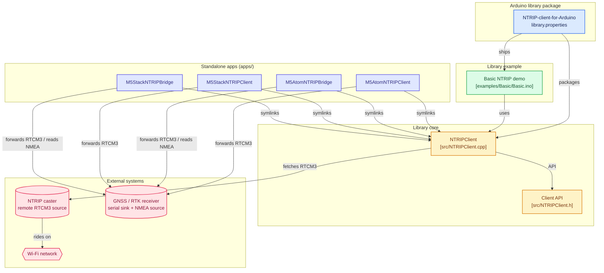

# NTRIP-client-for-Arduino

Fork from: [GLAY-AK2/NTRIP-client-for-Arduino](https://github.com/GLAY-AK2/NTRIP-client-for-Arduino)

NTRIP client library for ESP32 (Arduino). Receives RTCM3 correction data from NTRIP Caster and outputs via RS232 to GNSS receivers.

## アーキテクチャ



## Example

`examples/Basic/` には、このライブラリを使う最小コード (WiFi接続 → NTRIP接続 → 受信RTCM3をSerialへ) だけが入っている。
LCD/LED表示・指数バックオフ再接続・NMEAブリッジ・M5Stack/M5Atom 固有のUART配線などの実用機能は **`apps/` 配下** にまとめてあるのでそちらを参照のこと。

## Installation

### Arduino IDE
1. Download this repository as ZIP
2. Arduino IDE → Sketch → Include Library → Add .ZIP Library
3. Open the example from File → Examples → NTRIPClient → Basic

### arduino-cli
```bash
arduino-cli lib install --git-url https://github.com/yasunorioi/NTRIP-client-for-Arduino.git
```

### Dependencies

| Library | Required by |
|---------|-------------|
| WiFi (built-in)                                       | `examples/Basic` and all `apps/*` |
| [M5Unified](https://github.com/m5stack/M5Unified)     | `apps/M5Stack*` |
| [M5Atom](https://github.com/m5stack/M5Atom) + [FastLED](https://github.com/FastLED/FastLED) | `apps/M5Atom*` |
| [WiFiManager](https://github.com/tzapu/WiFiManager)   | all `apps/*` |

## Apps

`apps/` 配下は、`examples/` には収まらない規模の PlatformIO プロジェクトを置く場所。
このリポジトリの NTRIPClient ライブラリを `symlink://../..` で直接参照しているため、
ライブラリ側の変更がそのままビルドに反映される。

| App | Hardware | Pinout | 用途 |
|-----|----------|--------|------|
| `M5AtomNTRIPClient`  | M5Atom Lite/Matrix          | Serial2 G22(RX)/G19(TX) | NTRIP受信のみのリファレンス実装。指数バックオフ・ジッター・ストール検知付きで4G回線でも安定動作 |
| `M5AtomNTRIPBridge`  | M5Atom + 外部RTK受信機       | Serial3 G26/G32 (受信機) ・ Serial2 G22 TX (NMEA出力) | NTRIP↔RTK受信機↔NMEA の双方向ブリッジ。RTCM受信レートに応じて LED の色相がシフト |
| `M5StackNTRIPClient` | M5Stack Basic               | PORT.A G21(RX)/G22(TX)  | M5AtomNTRIPClient の M5Stack 版。LCDに状態・スループット表示。Atom版と同じGroveケーブルで RTK 受信機に接続できるよう 21/22 に揃えてある |
| `M5StackNTRIPBridge` | M5Stack Basic + [RS232F Module 13.2](https://www.switch-science.com/products/8965) | PORT.A G21/G22 (受信機) ・ RS232F G17 TX (NMEA→DB9) | M5AtomNTRIPBridge の M5Stack 版。受信機との通信は PORT.A、拾った NMEA は底面 RS232F モジュール経由で DB9 から外部へ |

### ビルド

```bash
cd apps/M5AtomNTRIPClient     # または M5AtomNTRIPBridge / M5StackNTRIPClient / M5StackNTRIPBridge
pio run                        # ビルド
pio run -t upload              # 書き込み
pio device monitor             # シリアルモニタ
```

WiFi 設定は WiFiManager:
- **M5Atom 版**: 未設定/接続失敗時に AP `M5Atom-NTRIP` (Bridge は `M5Atom-NTRIP-Bridge`) が立ち上がる。
- **M5Stack 版**: 起動時に BtnA を 2 秒押しでその場で設定ポータル (`NTRIP-Client` / `NTRIP-Bridge`)。押さなければ前回設定で接続。

## Misc

### kubota WRH1200A
WRH1200A must receive GPS + GLONASS only data. If you input other RTCM3 data (e.g. Galileo, BeiDou), it will not achieve RTK fix.

## References

- [ESP32 WPS (Qiita)](https://qiita.com/coppercele/items/6789deea453826916725)
- [M5Stack RS232 Module](https://twitter.com/M5Stack/status/1626045499437645824)

## License

LGPL-3.0 (inherited from original)
