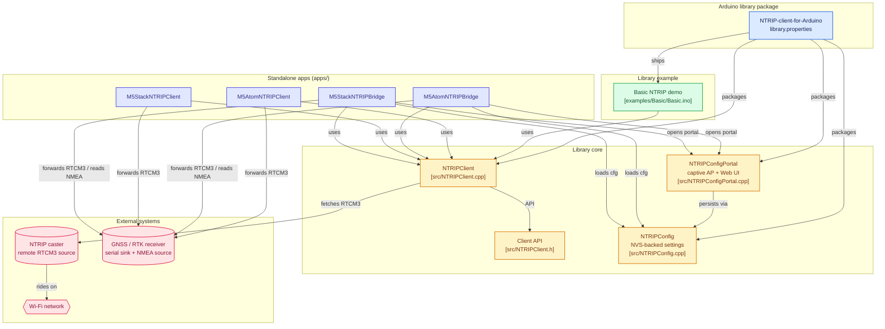

# NTRIP-client-for-Arduino

Fork from: [GLAY-AK2/NTRIP-client-for-Arduino](https://github.com/GLAY-AK2/NTRIP-client-for-Arduino)

NTRIP client library for ESP32 (Arduino). Receives RTCM3 correction data from NTRIP Caster and outputs via RS232 to GNSS receivers.

## アーキテクチャ



## Example

`examples/Basic/` には、このライブラリを使う最小コード (WiFi接続 → NTRIP接続 → 受信RTCM3をSerialへ) だけが入っている。
LCD/LED表示・指数バックオフ再接続・NMEAブリッジ・M5Stack/M5Atom 固有のUART配線などの実用機能は **`apps/` 配下** にまとめてあるのでそちらを参照のこと。

## Installation

### Arduino IDE
1. Download this repository as ZIP
2. Arduino IDE → Sketch → Include Library → Add .ZIP Library
3. Open the example from File → Examples → NTRIPClient → Basic

### arduino-cli
```bash
arduino-cli lib install --git-url https://github.com/yasunorioi/NTRIP-client-for-Arduino.git
```

### Dependencies

| Library | Required by |
|---------|-------------|
| WiFi (built-in)                                       | `examples/Basic` and all `apps/*` |
| Preferences (built-in)                                | `NTRIPConfig` (loaded by `apps/*Bridge`) |
| [M5Unified](https://github.com/m5stack/M5Unified)     | `apps/M5Stack*` |
| [M5Atom](https://github.com/m5stack/M5Atom) + [FastLED](https://github.com/FastLED/FastLED) | `apps/M5Atom*` |
| [WiFiManager](https://github.com/tzapu/WiFiManager)   | all `apps/*` |
| [ESPAsyncWebServer](https://github.com/ESP32Async/ESPAsyncWebServer) + [AsyncTCP](https://github.com/ESP32Async/AsyncTCP) | `NTRIPConfigPortal` (used by `apps/*Bridge`) |

## Apps

`apps/` 配下は、`examples/` には収まらない規模の PlatformIO プロジェクトを置く場所。
このリポジトリの NTRIPClient ライブラリを `symlink://../..` で直接参照しているため、
ライブラリ側の変更がそのままビルドに反映される。

| App | Hardware | Pinout | 用途 |
|-----|----------|--------|------|
| `M5AtomNTRIPClient`  | M5Atom Lite/Matrix          | Serial2 G22(RX)/G19(TX) | NTRIP受信のみのリファレンス実装。指数バックオフ・ジッター・ストール検知付きで4G回線でも安定動作 |
| `M5AtomNTRIPBridge`  | M5Atom + 外部RTK受信機       | Serial3 G26/G32 (受信機) ・ Serial2 G22 TX (NMEA出力) | NTRIP↔RTK受信機↔NMEA の双方向ブリッジ。RTCM受信レートに応じて LED の色相がシフト |
| `M5StackNTRIPClient` | M5Stack Basic               | PORT.A G21(RX)/G22(TX)  | M5AtomNTRIPClient の M5Stack 版。LCDに状態・スループット表示。Atom版と同じGroveケーブルで RTK 受信機に接続できるよう 21/22 に揃えてある |
| `M5StackNTRIPBridge` | M5Stack Basic + [RS232F Module 13.2](https://www.switch-science.com/products/8965) | PORT.A G21/G22 (受信機) ・ RS232F G17 TX (NMEA→DB9) | M5AtomNTRIPBridge の M5Stack 版。受信機との通信は PORT.A、拾った NMEA は底面 RS232F モジュール経由で DB9 から外部へ |

### ビルド

```bash
cd apps/M5AtomNTRIPClient     # または M5AtomNTRIPBridge / M5StackNTRIPClient / M5StackNTRIPBridge
pio run                        # ビルド
pio run -t upload              # 書き込み
pio device monitor             # シリアルモニタ
```

WiFi 設定は WiFiManager:
- **M5Atom 版**: 未設定/接続失敗時に AP `M5Atom-NTRIP` (Bridge は `M5Atom-NTRIP-Bridge`) が立ち上がる。
- **M5Stack 版**: 起動時に BtnA を 2 秒押しでその場で設定ポータル (`NTRIP-Client` / `NTRIP-Bridge`)。押さなければ前回設定で接続。

### NTRIP 設定 (Bridge アプリのみ)

Bridge 系 (`M5AtomNTRIPBridge` / `M5StackNTRIPBridge`) は NTRIP 接続先 (host/port/mountpoint/user/passwd) と VRS 関連設定を NVS に永続化する。値は `src/NTRIPConfig.{h,cpp}` の `NTRIPConfig` 構造体で管理し、Web UI で編集する。

初回起動 or 設定が空のとき:
1. WiFi が繋がった直後、自動で設定ポータル AP `NTRIP-Bridge-XXXX` (XXXX は chip ID 末尾) が立ち上がる。
2. パスワード: `configme123`。M5Stack なら LCD に WiFi-join 用 QR コードを表示するのでスマホでスキャン (キャプティブポータルで自動的にフォームへ遷移)。M5Atom はシリアルログに SSID/PASS/URL を出す。
3. フォームに入力して **Save & Reboot** → デバイスは home WiFi に戻って NTRIP 接続を開始する。

運用中に再設定したいとき:
- **M5Stack**: BtnB を 2 秒長押し → 設定モードに切替
- **M5Atom**: 本体ボタン (G39) を 2 秒長押し → 設定モードに切替

設定モード中は NTRIP ストリームが一時停止する (AP/STA 同時運用しない単純設計)。Web UI には Factory Reset ボタンもあり、NVS をクリアして初期状態に戻す。

Client 系 (`M5AtomNTRIPClient` / `M5StackNTRIPClient`) は最小リファレンスとしてハードコード設定のままで、NTRIPConfigPortal は使わない。

### リリース情報チェック (M5Stack のみ)

`M5StackNTRIPClient` / `M5StackNTRIPBridge` の LCD 最下部にはボタンラベル `[ ] [Display] [Update]` が常時表示される。各ボタンの挙動:

| ボタン | 短押し (tap) | 長押し (hold 2s) |
|--------|--------------|------------------|
| BtnA   | ―            | 起動時のみ: WiFi 設定ポータル |
| BtnB   | 画面切替 Status → Device Info → **Off (消灯)** → Status | 設定ポータル (Bridge のみ) |
| BtnC   | リリース情報チェック → OTA フロー (消灯中は画面復帰のみ) | ― |

**BtnC 短押しの OTA フロー** (`M5StackNTRIP{Client,Bridge}` 共通):

1. `https://api.github.com/repos/yasunorioi/NTRIP-client-for-Arduino/releases/latest` を取得して `FIRMWARE_VERSION` (build_flag) と比較
2. 同じバージョンなら 「Up to date」 を 5 秒表示して dismiss
3. 新しいバージョンがあれば、リリースノート (body) を最大 13 行表示 + `Update? A=No  C=Yes` プロンプト
4. **C 押下** で `https://github.com/.../releases/download/<tag>/<App>-<tag>.bin` から HTTPUpdate でダウンロード → 進捗バー表示 → 成功で自動再起動 (失敗時はエラー表示してメインに戻る)

`FIRMWARE_VERSION` は CI で git タグ (`vX.Y.Z`) が埋め込まれる。手元 PIO ビルドはデフォルトで `dev`。

**BtnB 短押しの画面切替**: Status (RTCM/NMEA レート + トラクター) → Device Info (NTRIP target / IP / MAC / Chip ID / FW / pinout 一覧) → Off (消灯; 夜間作業時の眩しさ対策、`setBrightness(0)`) と 3-way サイクル。Off 中に BtnC を誤押下しても OTA は起動せず画面復帰のみ。Off 中でも長押しの設定ポータル等は正常に動作 (画面が自動で復帰する)。

## Releases (CI)

`v*` タグを push すると `.github/workflows/release.yml` が走り、4 アプリ (`M5{Atom,Stack}NTRIP{Client,Bridge}`) を PlatformIO で並列ビルドして、同じタグの GitHub Release に `<App>-<tag>.bin` を添付する。

```bash
git tag v0.4.0
git push origin v0.4.0
```

Stack 系の partition table は `min_spiffs.csv` (app=1.9MB / ota_0=1.9MB) に切替済み。**既存デバイスへの初回書き込み時は flash 全消去が必要**:

```bash
pio run -t upload --upload-port /dev/cu.usbserial-XXXX
# もし起動しない (default 1.3MB partition で焼かれていた残骸) 場合:
esptool.py --port /dev/cu.usbserial-XXXX erase_flash
pio run -t upload
```

## Misc

### kubota WRH1200A
WRH1200A must receive GPS + GLONASS only data. If you input other RTCM3 data (e.g. Galileo, BeiDou), it will not achieve RTK fix.

## References

- [ESP32 WPS (Qiita)](https://qiita.com/coppercele/items/6789deea453826916725)
- [M5Stack RS232 Module](https://twitter.com/M5Stack/status/1626045499437645824)

## License

LGPL-3.0 (inherited from original)
